# 驗收紀錄 Checklist

## 使用說明

- 每完成一項檢查即勾選。
- 每個章節最後填寫驗收結果：`Pass` / `Fail` / `Pending`。
- 證據填寫檔案路徑、截圖名稱、Console 輸出片段或連結。
- 每個章節的「證據」欄位至少填入一個可追溯路徑（檔案、截圖或連結）。

---

## 總檢查清單（先實作，後文件）

- [x] 目錄樹初始化驗收完成（對應 `C1.1`）
- [x] 驗收前置環境準備完成（對應 `C0`）
- [x] 目錄樹輸出驗收完成（對應 `C1.2`）
- [x] 遞迴總容量計算驗收完成（對應 `C2.1`）
- [x] 副檔名搜尋驗收完成（對應 `C2.2`）
- [x] XML 輸出驗收完成（對應 `C2.3`）
- [x] Traverse Log 驗收完成（對應 `C3.1`）
- [x] 排序功能驗收完成（對應 `C4.1`）
- [x] 編輯功能驗收完成（對應 `C4.2`）
- [x] 標籤功能驗收完成（對應 `C4.3`）
- [x] Undo/Redo 驗收完成（對應 `C4.4`）
- [x] 功能驗證證據（Console）完整（對應 `C5`）
- [x] UML 與 ER 文件驗收完成（對應 `D1`、`D2`）
- [x] C# 專案可建置與執行驗收完成（對應 `D3`）
- [x] README/設計說明可重現驗收完成（對應 `D4`）

---

## 實作功能驗收（對應題目順序）

## C1 實作功能一：目錄結構呈現

### C0 驗收前置：環境準備（全新環境）

- [x] 從全新環境開始驗收（清空既有資料庫與 storage，重新啟動初始化流程）。
- [x] 已準備測試素材檔案，且路徑可存取：
```text
samples/
  Design01.docx
  Design02.docx
  Design03.docx
  Design04.docx
  sample.txt
  ShareX_4gVhhR5CHm.png
```
- [x] 以 Console 指令重建驗收用目錄樹與檔案配置，供後續 `C1~C5` 共用。
- [x] 重建完成後，`Root > tree` 結果會產生如下的狀態（建立時間可不同）：
```text
Root [目錄]
├── doc_0 [目錄]
├── doc_1 [目錄]
│   ├── doc_1_0 [目錄]
│   │   └── doc_1_0_subfolder [目錄]
│   │       └── nested.txt [純文字檔] (編碼: UTF-8, 大小: 0.01KB)
│   ├── ShareX_4gVhhR5CHm.png [圖片] (解析度: 606x169, 大小: 8.376KB)
│   ├── sample.txt [純文字檔] (編碼: UTF-8, 大小: 0.01KB, 建立時間: 2026-02-16 22:39:19)
│   └── Design02.docx [Word 檔案] (頁數: 4, 大小: 18.894KB, 建立時間: 2026-02-16 22:39:37)
├── doc_2 [目錄]
│   └── Design03.docx [Word 檔案] (頁數: 5, 大小: 18.943KB, 建立時間: 2026-02-16 22:40:36)
└── Design04.docx [Word 檔案] (頁數: 4, 大小: 18.975KB, 建立時間: 2026-02-16 22:41:18)
```
- [x] 補強情境覆蓋：
  - [x] 深層子目錄含檔案（驗證遞迴容量、遞迴搜尋、深拷貝）。
  - [x] 同層含多型別檔案（驗證排序與副檔名查詢穩定性）。
- [x] 已執行驗收方式：從空環境建立目錄、上傳素材、執行 `tree` 比對結構與節點語意。
- [x] 驗收結果：`Pass`
- [x] 準備流程：
```text
mkdir doc_0
mkdir doc_1
mkdir Root/doc_1 doc_1_0
mkdir Root/doc_1/doc_1_0 doc_1_0_subfolder
mkdir doc_2
upload Root/doc_1/doc_1_0/doc_1_0_subfolder samples/sample.txt
rename-file Root/doc_1/doc_1_0/doc_1_0_subfolder/sample.txt nested.txt
upload Root/doc_1 samples/ShareX_4gVhhR5CHm.png
upload Root/doc_1 samples/sample.txt
upload Root/doc_1 samples/Design02.docx
upload Root/doc_2 samples/Design03.docx
upload Root samples/Design04.docx
tree
```
- [x] 證據：
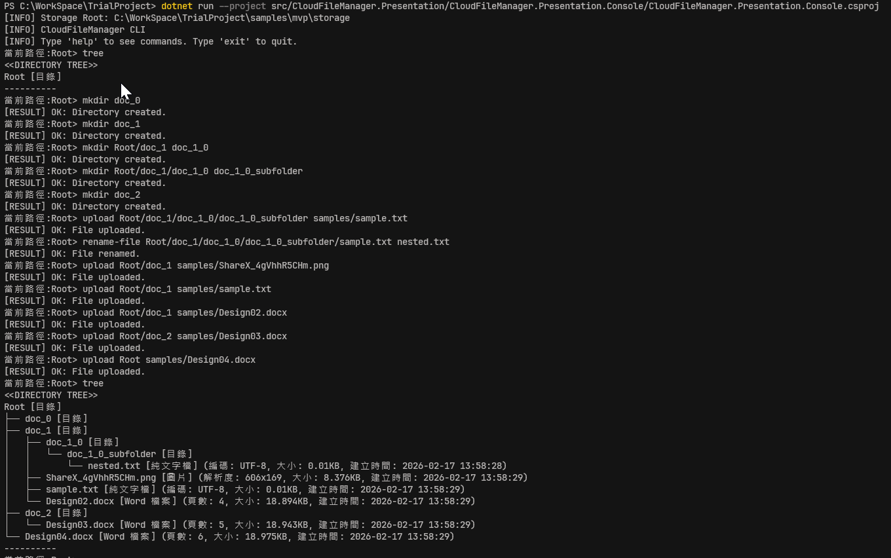
- [x] 備註：
全新環境之下建立資料夾與傳入檔案後使用tree指令驗證結果

### C1.1 目錄樹初始化正確（對應題目 1-1）

- [x] 目錄可包含多個檔案（非單一檔案限制）。
- [x] 目錄可包含子目錄，且子目錄可再包含子目錄（巢狀層級不設上限）。
- [x] 能建立至少 3 層以上的目錄樹（含根目錄與巢狀子目錄）以驗證遞迴結構。
- [x] 所有檔案皆隸屬於某個目錄，不存在孤立檔案節點。
- [x] 結構與本次驗收使用的初始化資料一致
- [x] 建立順序可被後續搜尋與 Log 重現（同層維持插入順序）。
- [x] 已執行驗收方式：啟動初始化流程，逐項比對節點存在性、父子關係與建立順序。
- [x] 驗收結果：`Pass`
- [x] 驗證流程：
```text
tree
cd doc_1
ls
cd doc_1_0
ls
cd /
tree
```
- [x] 證據：
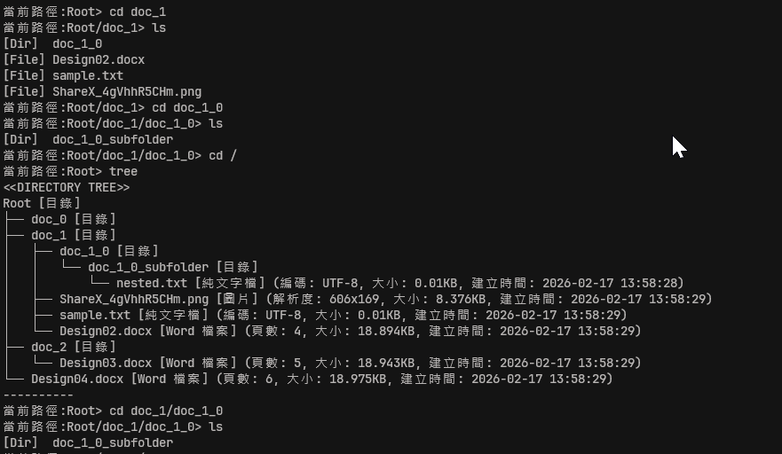
- [x] 備註：
以 `cd doc_1`、`ls`、`cd doc_1_0`、`ls`、`cd /`、`tree` 驗證目錄層級、父子關係與初始化資料一致，結果符合 C1.1 驗收條件。

### C1.2 目錄樹輸出正確（對應題目 1-1）

- [x] Console 可完整輸出目錄樹層級，縮排或前綴可清楚識別父子關係。
- [x] 檔案列印包含型別對應細節：Word 頁數、圖片解析度、文字檔編碼、檔案大小。
- [x] 輸出內容與初始化資料一致，無遺漏或錯誤節點。
- [x] 檔案大小顯示固定為 `KB`（來源若為 MB/B 需換算後顯示）。
- [x] 三種檔案型別皆可正確輸出共通屬性（Name/Size/CreatedTime）與專屬屬性（PageCount/Width/Height/Encoding）。
- [x] 已執行驗收方式：執行目錄樹列印功能，保存 Console 輸出並逐行比對。
- [x] 驗收結果：`Pass`
- [x] 驗證流程：
```text
tree
```
- [x] 證據：
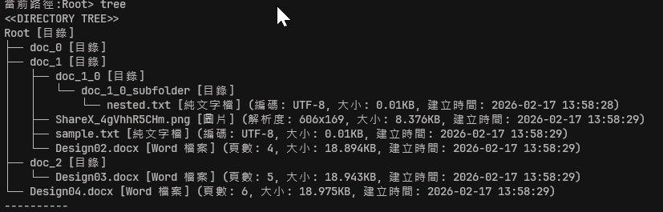
- [x] 備註：
`tree` 輸出可清楚辨識父子層級，且 Word/Image/Text 三種型別之專屬屬性與共通屬性皆正確顯示，檔案大小固定為 KB。

## C2 實作功能二：核心邏輯（Console 呈現功能結果）

### C2.1 遞迴總容量計算正確（對應題目 2-1）

- [x] 任一目錄總大小計算包含所有子目錄與檔案（遞迴完整）。
- [x] 檔案大小顯示與驗收固定使用 KB，換算遵循 `1MB=1024KB`、`1KB=1024B`。
- [x] 顯示值與預期人工換算一致（固定 KB，允許格式化但不可改變實際值）。
- [x] 目標目錄總大小等於其所有子孫檔案大小總和（人工換算比對）。
- [x] 至少驗證 1 個中介層目錄與 1 個根目錄結果。
- [x] 若使用本檔 `C0` 建立之資料集，`Root` 預期值需以實測輸出為準並固定記錄於證據中（四捨五入到小數第 3 位）。
- [x] 空目錄計算結果為 `0KB`。
- [x] 已執行驗收方式：對 Root 與至少兩個子目錄執行總容量計算並人工比對。
- [x] 驗收結果：`Pass`
- [x] 驗證流程：
```text
size Root
size Root/doc_1
size Root/doc_1/doc_1_0/doc_1_0_subfolder
```
- [x] 證據：
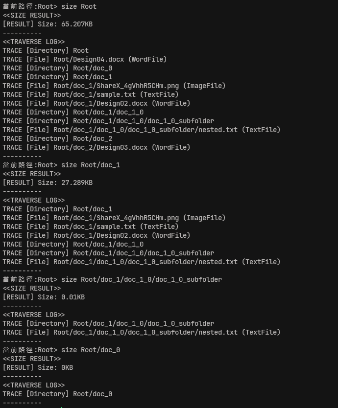
- [x] 備註：
實測結果：`size Root = 65.207KB`、`size Root/doc_1 = 27.289KB`、`size Root/doc_1/doc_1_0/doc_1_0_subfolder = 0.01KB`、`size Root/doc_0 = 0KB`；Traverse Log 可追溯遞迴走訪順序，符合 C2.1 驗收條件。

### C2.2 副檔名搜尋正確（對應題目 2-2）

- [x] 輸入副檔名可回傳目錄樹中所有符合檔案完整路徑。
- [x] 走訪規則在同一版本下保持一致，且同層順序可重現。
- [x] 回傳結果順序可重現，不額外進行隱性排序。
- [x] 搜尋常見副檔名（如 `.docx`、`.txt`、`.png`）命中正確檔案。
- [x] 若使用本檔 `C0` 建立之資料集，`.docx` 命中 3 筆（`Design02.docx`、`Design03.docx`、`Design04.docx`）。
- [x] 搜尋不存在副檔名（如 `.jpg`）時回傳空集合，不拋出錯誤。
- [x] 路徑格式一致（分隔符、大小寫策略、是否含 Root）。
- [x] 已執行驗收方式：以至少三組副檔名（多筆、單筆、無命中）執行搜尋並比對內容與可重現順序。
- [x] 驗收結果：`Pass`
- [x] 驗證流程：
```text
search .docx Root
search .docx Root/doc_1
search .txt Root
search .png Root
search .jpg Root
```
- [x] 證據：
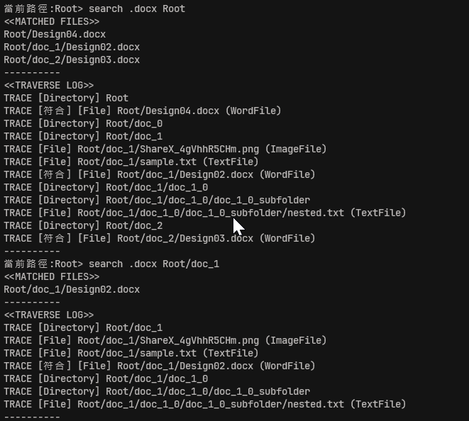
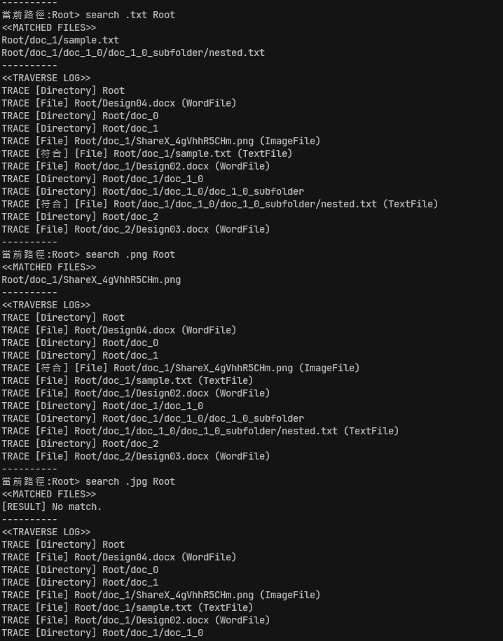
- [x] 備註：
實測結果：`search .docx Root` 命中 3 筆（`Root/Design04.docx`、`Root/doc_1/Design02.docx`、`Root/doc_2/Design03.docx`）；`search .docx Root/doc_1` 命中 1 筆；`search .txt Root` 命中 2 筆；`search .png Root` 命中 1 筆；`search .jpg Root` 無命中且無錯誤。Traverse Log 可追溯走訪順序且結果可重現。

### C2.3 XML 輸出正確（對應題目 2-3）

- [x] 可將當前目錄樹完整序列化為 XML。
- [x] XML 結構可正確表達目錄階層與檔案語意（型別與屬性資訊）。
- [x] 以語意一致驗收，不要求節點名稱逐字比對題目示例。
- [x] XML 保留 Root 到最深層子目錄的巢狀關係。
- [x] 檔案節點包含 Name、Size、CreatedTime 與型別專屬屬性。
- [x] 三種檔案型別（Word/Image/Text）皆可正確輸出對應資訊。
- [x] XML 可被標準解析器成功讀取（格式合法、標籤閉合正確）。
- [x] 已執行驗收方式：執行 XML 輸出，保存輸出並用人工檢視 + XML Parser 驗證。
- [x] 驗收結果：`Pass`
- [x] 驗證流程：
```text
xml Root
xml Root raw
```
- [x] 證據：
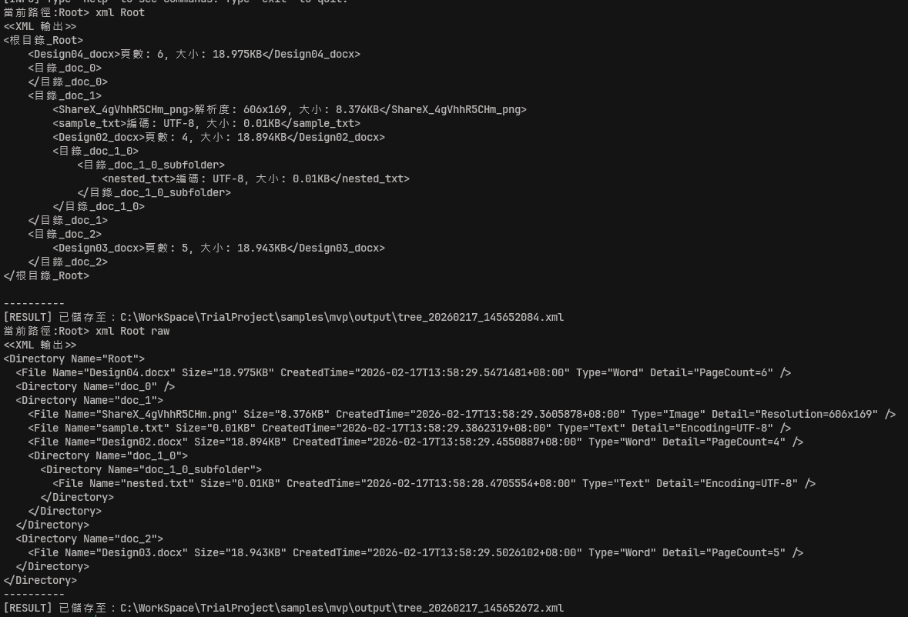

- [x] 備註：
`xml Root` 與 `xml Root raw` 皆成功輸出並寫入檔案（`samples/mvp/output/tree_*.xml`）；內容保留 Root 至最深層子目錄巢狀關係，且檔案節點包含共通屬性與型別語意（Word/Image/Text）。

## C3 實作功能三：功能進度追蹤

### C3.1 Traverse Log 可驗證（對應題目 3-1）

- [x] 計算總容量流程有輸出 Traverse Log。
- [x] 副檔名搜尋流程有輸出 Traverse Log。
- [x] Log 可追溯當前訪問節點順序，能說明程式如何遍歷結構。
- [x] Log 格式可清楚辨識遍歷路徑（例如 `Visiting: Root -> Project_Docs -> 需求規格書.docx` 或等價語意）。
- [x] 已執行驗收方式：分別執行計算與搜尋，確認 Console 有輸出可閱讀之 Traverse Log。
- [x] 驗收結果：`Pass`
- [x] 驗證流程：
```text
size Root
search .docx Root
```
- [x] 證據：
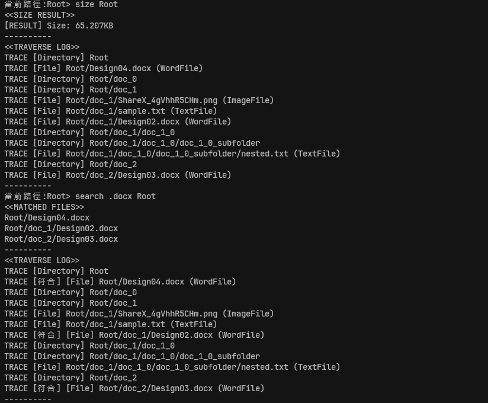
- [x] 備註：
`size Root` 與 `search .docx Root` 皆輸出可閱讀的 Traverse Log，包含目錄與檔案訪問順序，且搜尋流程可標記符合節點（`TRACE [符合]`），可完整追溯遍歷過程。

## C4 實作功能四：進階功能（Bonus）

### C4.1 排序功能（對應題目 4-1）

- [x] 可依 `名稱`、`大小`、`副檔名` 進行排序。
- [x] 每種排序鍵皆支援 `升冪` 與 `降冪`。
- [x] 排序採全域環境設定：設定後對後續 `lsr` 查詢一律套用，不區分目錄 scope。
- [x] 同鍵值時維持穩定排序，並以建立順序作為次要順序。
- [x] 同資料集重複執行時，結果穩定且可重現。
- [x] 已執行驗收方式：每種排序鍵至少測試升冪/降冪各 1 次，並驗證 `sort -> lsr -> undo/redo -> lsr` 的可見一致性。
- [x] 驗收結果：`Pass`
- [x] 驗證流程：
```text
lsr
sort size desc
undo
lsr
redo
lsr
sort name asc
sort ext desc
```
- [x] 證據：
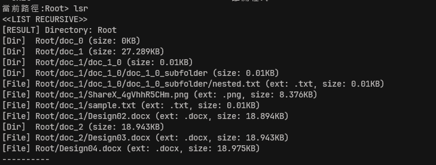
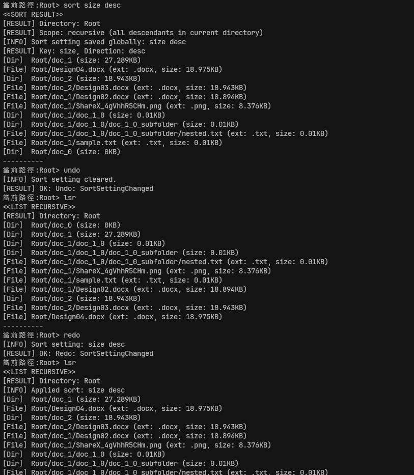
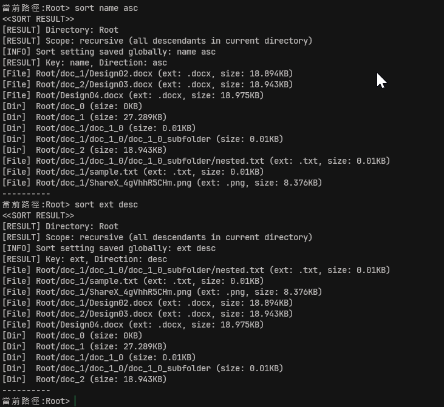
- [x] 備註：`sort size desc`、`sort name asc`、`sort ext desc` 皆可生效；`lsr` 會查詢到目前全域排序結果，且 `undo/redo` 可還原與重做排序狀態，結果可重現。

### C4.2 編輯功能（對應題目 4-2）

- [x] 支援節點刪除，刪除後不應殘留孤兒節點。
- [x] 支援節點複製/貼上，貼上後父子關係正確。
- [x] 目錄複製為深拷貝（含子節點與屬性），來源與複本互不影響。
- [x] 名稱衝突採明確策略（預設 `Reject`），不得靜默覆蓋既有節點。
- [x] 編輯後目錄樹輸出、容量計算、搜尋結果可正確反映變更。
- [x] 已執行驗收方式：針對刪除與複製/貼上各執行至少 1 組案例並比對前後結果。
- [x] 驗收結果：`Pass`
- [x] 驗證流程：
```text
tree
copy Root/doc_1/doc_1_0
paste Root/doc_2
paste Root/doc_2
tree
rename-dir Root/doc_2/doc_1_0 doc_1_0_copy
delete-dir Root/doc_2/doc_1_0_copy/doc_1_0_subfolder
tree
size Root/doc_2
search .txt Root/doc_2
delete-file Root/doc_2/doc_1_0_copy/doc_1_0_subfolder/nested.txt
delete-dir Root/doc_2/doc_1_0_copy/doc_1_0_subfolder
tree
```
- [x] 證據：
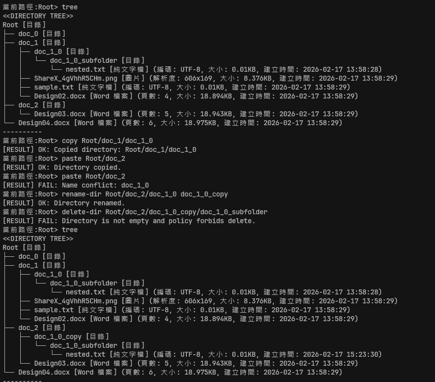
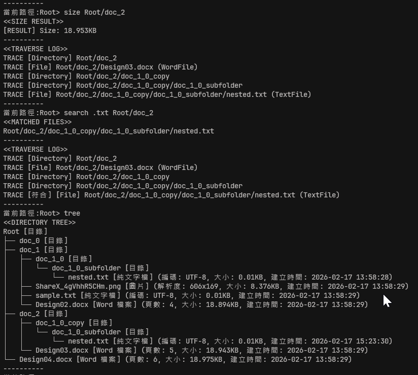
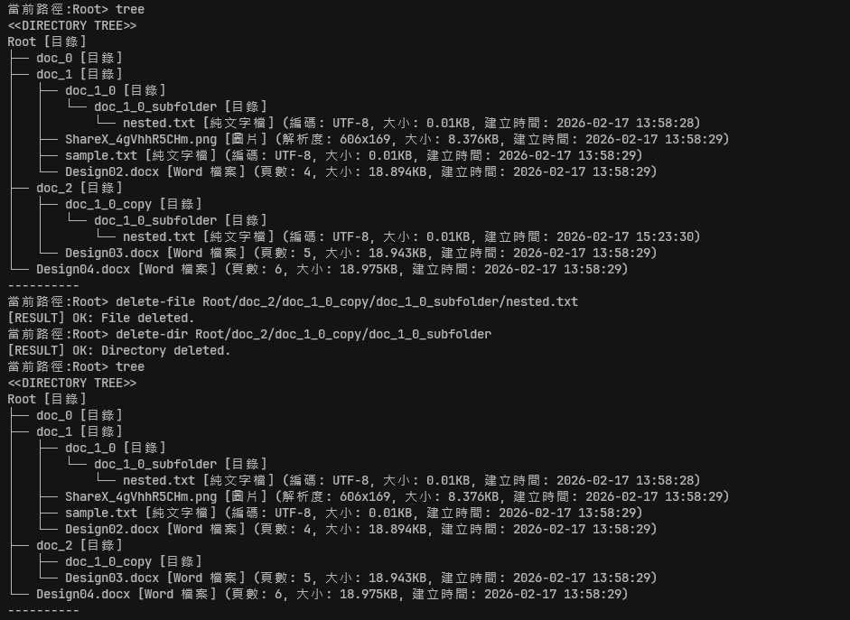
- [x] 備註：已驗證 `copy/paste`、名稱衝突拒絕（`Name conflict: doc_1_0`）與 `rename-dir`；先出現 `ForbidNonEmpty` 刪除失敗，後續以 `delete-file` 先刪除 `nested.txt` 後成功 `delete-dir`，最終 `tree` 無孤兒節點，且 `size/search` 可反映編輯結果。

### C4.3 標籤功能（對應題目 4-3）

- [x] 支援標籤：`Urgent（紅色）`、`Work（藍色）`、`Personal（綠色）`。
- [x] 標籤集合固定為上述三種，不包含自訂/新增/刪除標籤管理。
- [x] 每個節點可套用多重標籤。
- [x] 可正確查詢與顯示標籤語意（以 Console 呈現為準）。
- [x] 已執行驗收方式：建立單標籤與多標籤案例，驗證查詢與顯示結果。
- [x] 驗收結果：`Pass`
- [x] 驗證流程：
```text
tag list
tag Root/doc_1/sample.txt Urgent
tag Root/doc_1/sample.txt Work
tag list Root/doc_1/sample.txt
tag find Urgent Root
tag find Urgent Root/doc_0
tag list
tag Root/doc_2/Design03.docx Personal
tag list Root/doc_2/Design03.docx
```
- [x] 證據：
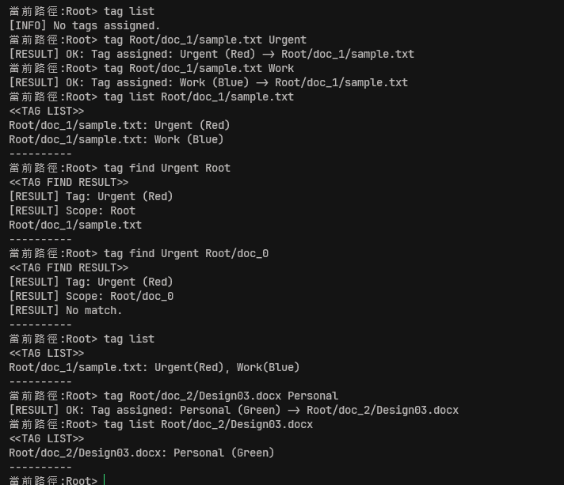
- [x] 備註：本次以 Console 驗收為主，已驗證固定三標籤（Urgent/Work/Personal）、多重標籤、scope 查詢與語意顯示。

### C4.4 狀態管理（對應題目 4-4）

- [x] 針對可編輯操作支援 Undo **（本版作用範圍：排序設定、標籤新增/移除）**。
- [x] 本版 C4.4 僅涵蓋上述操作；不包含刪除、複製/貼上、重新命名、移動等其他編輯操作。
- [x] Undo/Redo 作用於目前執行階段（in-memory session），程式重啟後歷程不保留。
- [x] Undo 後可正確執行 Redo 並回到預期狀態。
- [x] 執行新操作後，Redo 堆疊會被清空且不再可重做舊分支。
- [x] 連續多步操作可維持狀態一致，不遺失歷程。
- [x] 操作失敗（例如目標不存在、參數錯誤）不得寫入 Undo/Redo 歷程。
- [x] 已執行驗收方式：執行多步操作序列並驗證 Undo/Redo 每一步狀態。
- [x] 驗收結果：`Pass`
- [x] 驗證流程：
```text
tag list
tag Root/doc_2/Design03.docx Personal
tag list Root/doc_2/Design03.docx
tag Root/doc_2/Design03.docx Personal
undo
tag list Root/doc_2/Design03.docx
redo
tag list Root/doc_2/Design03.docx
tag remove Root/doc_2/Design03.docx Personal
tag list Root/doc_2/Design03.docx
undo
tag list Root/doc_2/Design03.docx
redo
tag list Root/doc_2/Design03.docx

sort size desc
undo
lsr
redo
lsr
undo
sort name asc
redo
lsr
```
- [x] 證據：
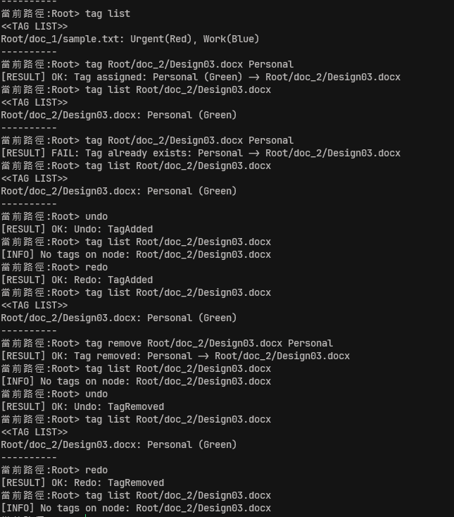
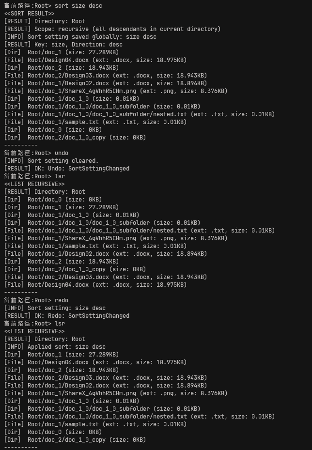
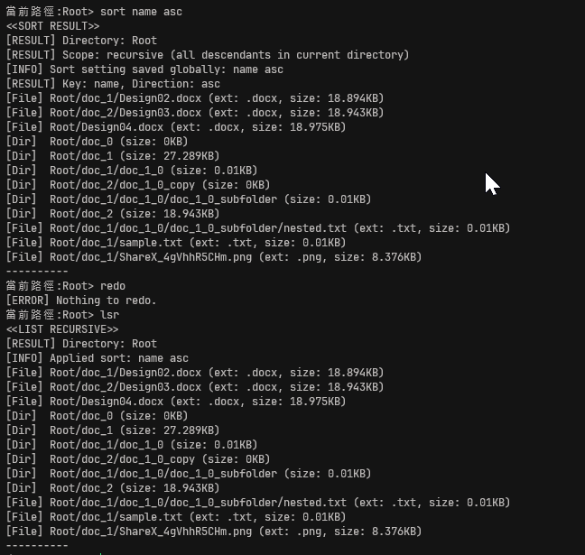
- [x] 備註：已驗證標籤新增/移除與排序設定（全域環境設定）的 Undo/Redo。`tag` 重複新增失敗不會改變狀態，且後續 `undo/redo` 仍可回放最後一次成功操作；排序在 `undo/redo` 前後可由 `lsr` 觀察差異，並已驗證 `undo` 後執行新排序操作時 `redo` 會回傳 `Nothing to redo.`。

## C5 功能執行結果驗證資料完整（Console）

- [x] 具備可追溯之功能驗證輸出（Console Log 或截圖）。
- [x] 驗證資料至少涵蓋 `C1~C4`（實作功能 1~4）對應場景。
- [x] 目錄樹輸出、總容量計算、副檔名搜尋、XML 輸出、Traverse Log 皆有證據。
- [x] 已補齊 `C4.1~C4.4`（Bonus）對應證據。
- [x] Console 介面可對應至少一組核心操作證據。
- [x] 已執行驗收方式：依功能清單逐項附上輸出片段與執行時間/命令。
- [x] 驗收結果：`Pass`
- [x] 證據：`../images/C_0_init.png`、`../images/C_1_1.png`、`../images/C_1_2.png`、`../images/C_2_1.png`、`../images/C_2_2_docx.png`、`../images/C_2_2.png`、`../images/C_2_3.png`、`../images/C_2_3_raw.png`、`../images/C_3_1.png`、`../images/C_4_1_0.png`、`../images/C_4_1_1.png`、`../images/C_4_1_2.png`、`../images/C_4_2.png`、`../images/C_4_3.png`、`../images/C_4_4_tags.png`、`../images/C_4_4_sort.png`、`../images/C_4_4_sort2.png`
- [x] 備註：本輪 C5 驗收以 Console 為範圍，證據已覆蓋 C1~C4 全部場景與 Bonus（C4.1~C4.4）。

---

## 文件與交付驗收（後段）

## D1 UML Class Diagram 交付完整（對應交付任務 1）

- [x] 已提供 UML Class Diagram，且可辨識類別、屬性、關聯與導向。
- [x] 圖中明確包含 Inheritance、Association，及 Aggregation 或 Composition（至少其一）。
- [x] UML 檔案存在且可讀（例如 `delivery/UMLClassDirgram.md`）。
- [x] 已執行驗收方式：逐項點檢圖面元素並對照 `docs/reference/requirement.md`。
- [x] 驗收結果：`Pass`
- [x] 證據：[UML Class Diagram](./UMLClassDirgram.md)
- [x] 備註：Domain classDiagram 已呈現 `FileSystemNode/CloudDirectory/CloudFile` 與 `WordFile/ImageFile/TextFile` 之繼承關係，並包含 Association（`CloudFile -> CloudFileType`）與 Composition（`CloudDirectory` 持有子目錄/檔案）；另補充跨層職責 flowchart。

## D2 ER Model 交付完整（對應交付任務 2）

- [x] 已提供 ER Model，且可對應核心實體與關係。
- [x] 欄位設計可支撐目錄階層、檔案共通屬性與型別專屬屬性。
- [x] ER 文件存在且可讀（例如 `delivery/ERModel.md`）。
- [x] 已執行驗收方式：以需求欄位對照 ER 欄位，確認無遺漏與語意衝突。
- [x] 驗收結果：`Pass`
- [x] 證據：[ER Model](./ERModel.md)
- [x] 備註：ER 圖與文字說明已對齊目前 EF Core Entity/Configuration（含 `relative_path`、標籤關聯、複合鍵與檢核約束），可支撐目錄階層與三種檔案型別專屬欄位。

## D3 C# 程式碼實作可建置與執行（對應交付任務 3）

- [x] 交付內容包含可檢視之 C# 程式碼。
- [x] 專案可建置，且可執行核心流程。
- [x] C# 專案檔存在（`.csproj`）。
- [x] 主要功能入口可執行（Console 模式即可）。
- [x] 與 `C1~C4` 對應之功能程式存在且可觸發。
- [x] 已執行驗收方式：執行建置與啟動指令並保存輸出結果。
- [x] 驗收結果：`Pass`
- [x] 證據：`TrialProject.sln`、`src/CloudFileManager.Presentation/CloudFileManager.Presentation.Console/CloudFileManager.Presentation.Console.csproj`、`src/`
- [x] 備註：已完成 `C1~C4.4` Console 實測並可持續執行，對應核心流程可觸發。

## D4 README/設計說明可重現驗證流程（對應交付任務 5）

- [x] [README](../README.md)（與必要設計說明）可引導第三方完成建置、執行與驗證。
- [x] 文件內容與交付模型文件互相一致。
- [x] [README](../README.md) 包含環境需求、建置步驟、執行方式與設計摘要。
- [x] 文件有對照交付模型文件，且路徑與證據一致。
- [x] 已執行驗收方式：依 [Acceptance Criteria](./AcceptanceCriteria.md) 章節順序執行並確認驗證結果可重現。
- [x] 驗收結果：`Pass`
- [x] 證據：[README](../README.md)、[UML Class Diagram](./UMLClassDirgram.md)、[ER Model](./ERModel.md)
- [x] 備註：README 已聚焦 Console 驗證流程，包含 Quick Start、指令索引、常用設定鍵與交付文件 hyperlink，可支援第三方依文件完成重現。
