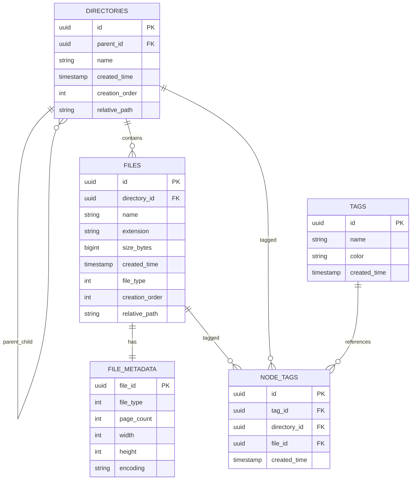

# 交付文件 - ER Model

此文件依目前專案 EF Core 實作更新，主要對照：

- `src/CloudFileManager.Infrastructure/DataAccess/EfCore/Entities/*.cs`
- `src/CloudFileManager.Infrastructure/DataAccess/EfCore/Configurations/*.cs`

## 關係與鍵（對應實作）

- `directories.parent_id -> directories.id`（自關聯，刪除限制 `Restrict`）
- `files.directory_id -> directories.id`（一對多，刪除 `Cascade`）
- `file_metadata.file_id -> files.id`（一對一主鍵關聯）
- `file_metadata(file_id, file_type) -> files(id, file_type)`（複合 FK 對應 Alternate Key）
- `node_tags.tag_id -> tags.id`（一對多，刪除 `Cascade`）
- `node_tags.directory_id -> directories.id`（可空，刪除 `Cascade`）
- `node_tags.file_id -> files.id`（可空，刪除 `Cascade`）

## 重要約束（Constraint）

- `directories`
  - `UNIQUE(parent_id, name)`
- `files`
  - `UNIQUE(directory_id, name)`
  - `CHECK SizeBytes >= 0`
  - `CHECK Extension = lower(Extension) AND Extension LIKE '.%'`
  - `CHECK FileType IN (1, 2, 3)`
- `file_metadata`
  - `CHECK CK_file_metadata_type_fields`
    - Word: `PageCount` 必填
    - Image: `Width/Height` 必填
    - Text: `Encoding` 必填
- `tags`
  - `UNIQUE(name)`
  - `CHECK Name IN ('Urgent','Work','Personal')`
  - `CHECK Color IN ('Red','Blue','Green')`
- `node_tags`
  - XOR 約束：`DirectoryId` 與 `FileId` 二擇一
  - `UNIQUE(directory_id, tag_id) WHERE directory_id IS NOT NULL`
  - `UNIQUE(file_id, tag_id) WHERE file_id IS NOT NULL`

## 設計補充

- 路徑欄位在實作中為 `relative_path`
- 標籤採主檔（`tags`）+ 關聯檔（`node_tags`）設計，符合多對多延展。
- 檔案型別專屬欄位放在 `file_metadata`，並以約束確保型別一致性。
