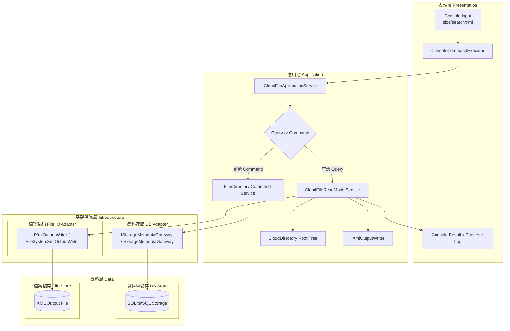
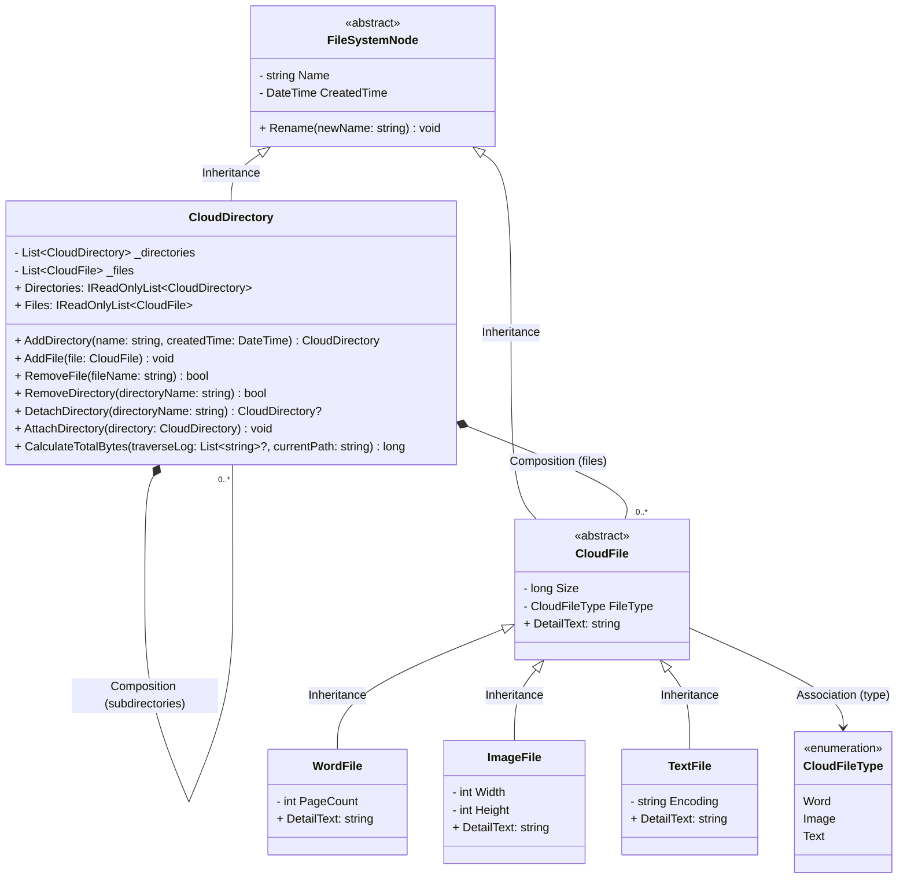

# 交付文件 UML 系統架構

以下圖面採「跨層職責區分」方式呈現，將 Presentation / Application / Infrastructure / Data 明確分層（使用 flowchart）。

---
# 交付文件 - UML Class Diagram

此圖以目前程式碼實作為基準，來源主要對照：

- `src/CloudFileManager.Domain/FileSystemNode.cs`
- `src/CloudFileManager.Domain/CloudDirectory.cs`
- `src/CloudFileManager.Domain/CloudFile.cs`
- `src/CloudFileManager.Domain/WordFile.cs`
- `src/CloudFileManager.Domain/ImageFile.cs`
- `src/CloudFileManager.Domain/TextFile.cs`
- `src/CloudFileManager.Domain/Enums/CloudFileType.cs`

## 指定關係對照

- Inheritance
  - `FileSystemNode <- CloudDirectory`
  - `FileSystemNode <- CloudFile`
  - `CloudFile <- WordFile/ImageFile/TextFile`
- Association
  - `CloudFile -> CloudFileType`（檔案型別關聯）
- Composition
  - `CloudDirectory *-- CloudDirectory`（子目錄）
  - `CloudDirectory *-- CloudFile`（檔案）

## 驗收重點（對應 D1）

- 圖上可辨識類別、屬性、操作與導向。
- 圖上明確包含 Inheritance、Association、Composition。
- 與實作一致：目錄樹遞迴結構與三種檔案型別皆有對應。

---
