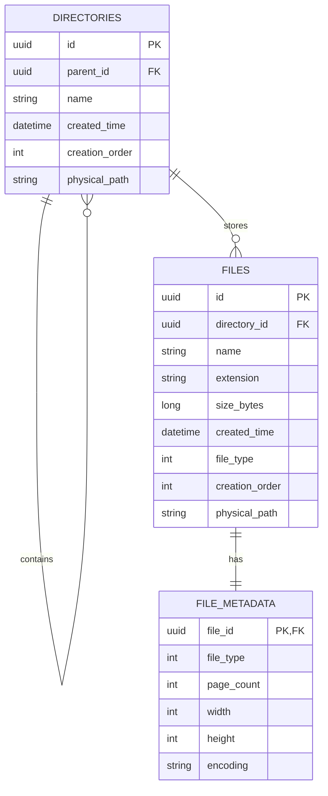

# 交付文件 - ER Model

此文件為交付版 ER Model，來源對齊 `docs/er-model.md`。

## 指定關係與鍵

- `directories.parent_id -> directories.id`（自關聯）
- `files.directory_id -> directories.id`（一對多）
- `file_metadata.file_id -> files.id`（一對一）
- `file_metadata(file_id, file_type) -> files(id, file_type)`（複合 FK）
