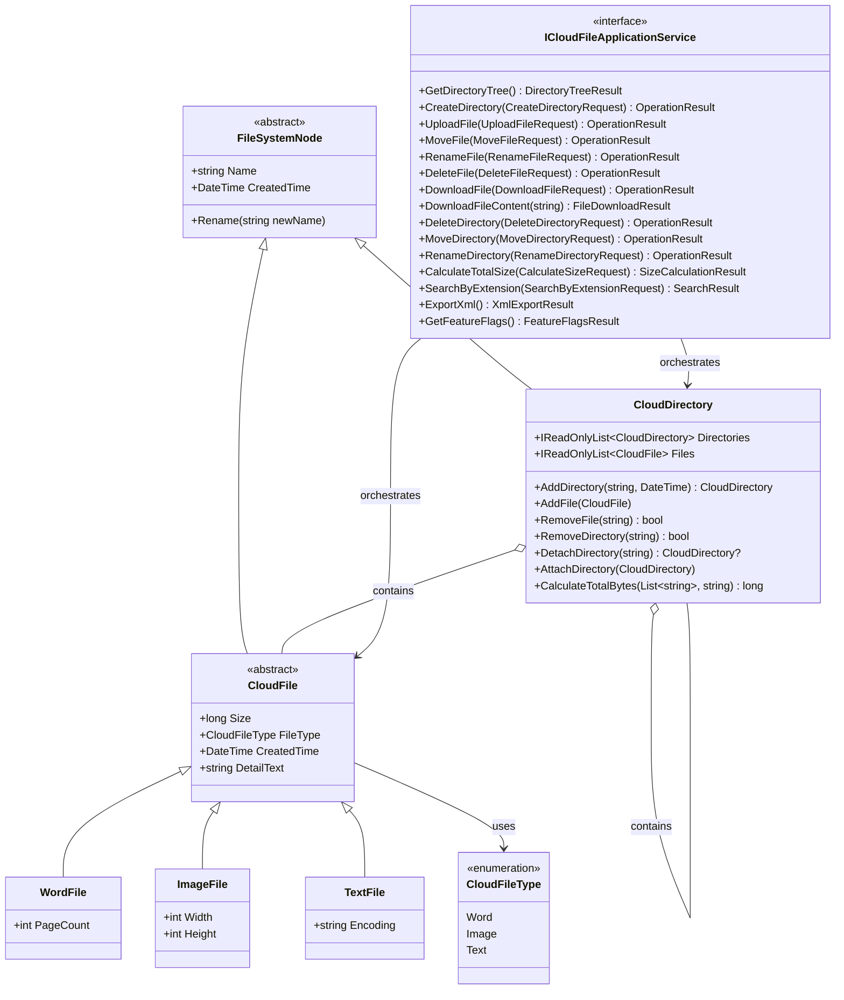

# 交付文件 - UML Class Diagram

此文件為交付版 UML Class Diagram，已依目前程式碼更新（`src/CloudFileManager.Domain` 與 `src/CloudFileManager.Application/Interfaces`）。

## 指定關係對照

- Inheritance：`FileSystemNode <|-- CloudFile`、`CloudFile <|-- WordFile` 等
- Association：`ICloudFileApplicationService --> CloudDirectory`、`ICloudFileApplicationService --> CloudFile`
- Aggregation：`CloudDirectory o-- CloudDirectory`、`CloudDirectory o-- CloudFile`
- Enum Association：`CloudFile --> CloudFileType`
