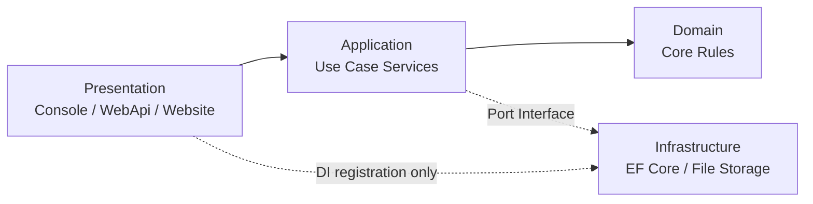

# 雲端檔案管理系統架構說明

## 1. 專案基線（以現有程式碼為準）
- 解決方案：`TrialProject.sln`。
- 三層主幹：`Presentation`、`Domain`、`DataAccess`（實作專案為 `CloudFileManager.Infrastructure`）。
- 跨層協作專案：`CloudFileManager.Application`、`CloudFileManager.Contracts`、`CloudFileManager.Shared`。
- 表現層通道：`Console`、`WebApi`、`Website` 三專案並行，對齊 `docs/requirement.md` 的多介面驗證要求。

## 2. 專案對應與責任切分
- `src/CloudFileManager.Domain`：核心實體與規則（`CloudDirectory`、`CloudFile`、`WordFile`、`ImageFile`、`TextFile`），不承載 I/O 與基礎設施細節。
- `src/CloudFileManager.Application`：用例編排與流程協調，對外統一入口 `ICloudFileApplicationService`，內部分為讀取模型、檔案命令、目錄命令三類服務。
- `src/CloudFileManager.Infrastructure`：DataAccess 與檔案儲存實作，包含 EF Core `CloudFileDbContext`、Migration、`StorageMetadataGateway`、XML 輸出與啟動初始化。
- `src/CloudFileManager.Presentation.*`：通道適配。`Console` 直連 Application；`WebApi` 提供 HTTP 契約；`Website` 僅透過 `FileSystemApiClient` 呼叫 WebApi。
- `src/CloudFileManager.Contracts`：跨邊界 DTO（Website/WebApi 傳輸契約），保持扁平命名空間，避免多層巢狀命名干擾可讀性。

## 3. 相依邊界與 Composition Root
- `Domain` 不得依賴 `Application`、`Infrastructure`、`Presentation`。
- `Application` 以介面依賴外部能力（例如 `IStorageMetadataGateway`、`IXmlOutputWriter`），不得直接依賴 EF Core 或檔案系統 API。
- `Infrastructure` 實作 `Application` 所需 Port，透過 DI 註冊注入。
- `Presentation` 允許在 Composition Root 註冊 `Infrastructure + Application`，但 Controller/CommandExecutor 不得直接 new 具體儲存實作。
- Composition Root 僅限：
  - `src/CloudFileManager.Presentation/CloudFileManager.Presentation.Console/Program.cs`
  - `src/CloudFileManager.Presentation/CloudFileManager.Presentation.WebApi/Program.cs`
  - `src/CloudFileManager.Presentation/CloudFileManager.Presentation.WebApi/DependencyRegister.cs`

## 4. MVP 功能與用例服務對應
- F1 目錄樹呈現：`ICloudFileApplicationService.GetDirectoryTree()`，由 `CloudFileReadModelService` 輸出樹狀資料與展示行。
- F2 遞迴容量計算：`CalculateTotalSize`，Domain 使用 `CloudDirectory.CalculateTotalBytes(...)`，Application 負責格式化與回傳模型。
- F3 副檔名搜尋：`SearchByExtension`，在讀取服務中走訪目錄樹並維持發現順序回傳。
- F4 XML 輸出：`ExportXml`，由 Application 組裝 XML，`IXmlOutputWriter` 決定輸出到 Console 或檔案路徑。
- F5 Traverse Log：`SizeCalculationResult.TraverseLog`、`SearchResult.TraverseLog` 為跨通道可驗證輸出，Console/WebApi/Website 共享同一資料語意。

## 5. Traversal 一致性規則（驗收關鍵）
- 走訪策略固定為 DFS Pre-order。
- 同層節點順序以建立順序為準，不得額外排序。
- 計算與搜尋需共用相同走訪語意，避免「結果正確但過程不一致」。
- Traverse Log 保留目錄與檔案訪問軌跡，供 API 與 UI 驗證。

## 6. 資料與模型邊界
- `Presentation.WebApi` 使用通道模型：`Model/FileSystemApiRequests.cs`、`Model/FileSystemApiResponses.cs`。
- `Website` 使用 `CloudFileManager.Contracts` DTO 與 `FileSystemApiClient`，不直接使用 Domain 物件。
- `Application` 輸入輸出採 request/result 型別（`ApplicationRequests.cs`、`ApplicationResults.cs`），避免控制器直接耦合 Domain。
- Mapping 發生在通道邊界（API Model Mapper、Controller、API Client），不滲透至 Domain。

## 7. DataAccess 與儲存策略
- 預設 Provider 為 SQLite，可透過 `Database.Provider` 切換為 SQL Server。
- `Infrastructure.DependencyRegister` 依設定選擇 `UseSqlite` 或 `UseSqlServer`，不需修改 Domain/Application 契約。
- Schema 管理採 EF Core Code First，Migration 位於 `src/CloudFileManager.Infrastructure/DataAccess/EfCore/Migrations`。
- 啟動時可依 `Database.MigrateOnStartup` 決定是否自動 Migration，並包含 Schema Ready 檢查。
- 檔案實體儲存與中繼資料更新由 `StorageMetadataGateway` 協調，維持持久層一致性。

## 8. 設定責任邊界（WebApi / Website / Console）
- `WebApi` 為系統級設定 SSOT：`Storage.*`、`Database.*`、`FeatureFlags.*`、`Management.*`、`AllowedExtensions.*`、`Output.*`。
- `Website` 僅管理站台設定（核心為 `WebApiBaseUrl`），不得承載資料庫、儲存路徑與後端業務策略。
- `Console` 屬系統管理通道，可載入完整系統設定，但不得定義與 WebApi 衝突的第二真實來源。
- 新增設定鍵時，優先判斷是否屬於後端規則；屬後端者統一放置於 WebApi 設定責任範圍。

## 9. 測試與架構守護
- 單元測試：`tests/CloudFileManager.UnitTests`，覆蓋 MVP 功能、設定驗證、路徑規則、DTO 與一致性檢查。
- 整合測試：`tests/CloudFileManager.IntegrationTests`，覆蓋 Provider 相容、Website-Api flow、上傳流程等跨層行為。
- 架構守護重點：
  - Provider 切換不得破壞對外契約。
  - Traverse 規則需可重現且可驗證。
  - Website 不得繞過 WebApi 直接操作 DataAccess。

## 10. Domain 可發佈與契約拆分策略
- `CloudFileManager.Domain` 維持可獨立打包邊界（`dotnet pack`）。
- 僅在以下情況成立時，才抽離 `Domain.Abstractions`：
  - 跨解決方案重用同一份契約。
  - 契約需獨立版本化。
  - 外掛（Plugin）需獨立載入/卸載契約。
- 未達條件時維持單一 Domain 專案，避免過度工程。

## 11. 與需求文件對齊
- 本文件對齊 `docs/requirement.md` 的 F1~F5 與三通道驗證要求。
- 規格細目與驗收編號請以 `docs/spec.md`、`docs/mvp_ac.md` 為準。
- 設定邊界檢查流程請參考 `docs/config-boundary-checklist.md`。
