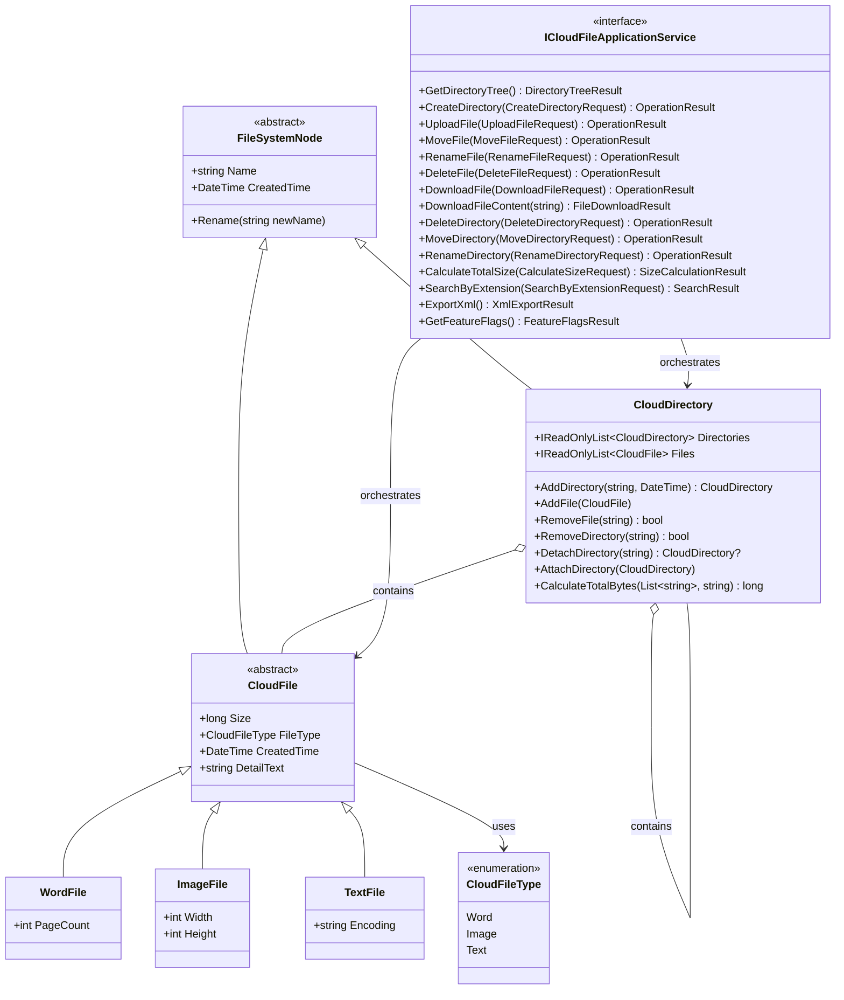

# 雲端檔案管理系統 UML Class Diagram（MVP）

本文件對應 `SP-DEL-001`，描述核心領域模型與關聯，並依目前程式碼（`src/CloudFileManager.Domain` 與 `src/CloudFileManager.Application/Interfaces`）同步更新。

## 關係對照

- Inheritance：`FileSystemNode <|-- CloudFile`、`CloudFile <|-- WordFile` 等
- Association：`ICloudFileApplicationService --> CloudDirectory`、`ICloudFileApplicationService --> CloudFile`
- Aggregation：`CloudDirectory o-- CloudDirectory`、`CloudDirectory o-- CloudFile`
- Enum Association：`CloudFile --> CloudFileType`
