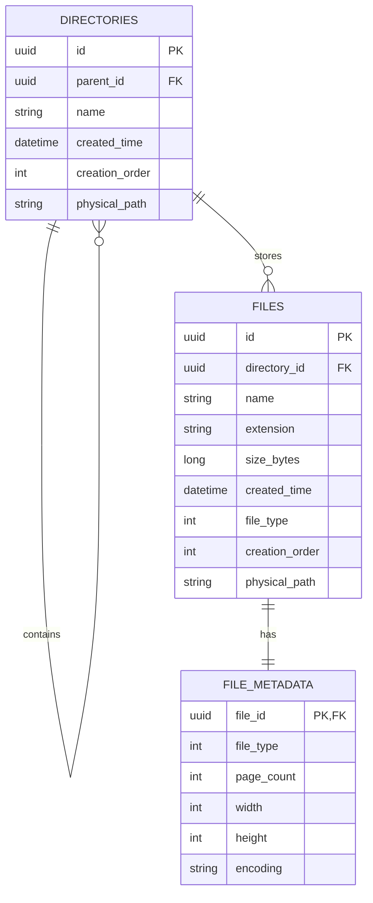

# 雲端檔案管理系統 ER Model（MVP）

本文件對應 `docs/requirement.md` 與 `docs/spec.md` 之交付項目 `ER Model（Schema 設計）`，採用 Markdown + Mermaid 表示。

## ER Diagram（Mermaid）

## 關聯與鍵（Key / Relationship）

- `directories.parent_id -> directories.id`（自關聯，表示目錄樹）
- `files.directory_id -> directories.id`（一個目錄可包含多個檔案）
- `file_metadata.file_id -> files.id`（一對一，檔案專屬 metadata）
- `file_metadata(file_id, file_type) -> files(id, file_type)`（複合 FK，確保 metadata 與 file type 一致）

## 主要約束（Constraints）

- `UNIQUE (directories.parent_id, directories.name)`：同層目錄不可重名
- `UNIQUE (files.directory_id, files.name)`：同層檔案不可重名
- `UNIQUE (files.id, files.file_type)`：提供 metadata 複合 FK 參照
- `CHECK (files.size_bytes >= 0)`：容量不可為負值
- `CHECK (files.extension)`：副檔名需為小寫且以 `.` 開頭（由 DB 規則或應用層正規化）
- `CHECK (file_metadata)`：依 `file_type` 驗證欄位合法性
  - Word：`page_count` 必填，`width/height/encoding` 為 `NULL`
  - Image：`width`、`height` 必填，`page_count/encoding` 為 `NULL`
  - Text：`encoding` 必填，`page_count/width/height` 為 `NULL`

## 建議索引（Index）

- `IX_directories_parent_creation_order (parent_id, creation_order)`
- `IX_files_directory_creation_order (directory_id, creation_order)`
- `IX_files_extension (extension)`
- `IX_files_file_type (file_type)`
- `IX_files_physical_path (physical_path)`（依需求可設為 Unique）

## 設計備註

- 本版採三表設計：`directories`、`files`、`file_metadata`。
- 與「每種 metadata 各一表」相比，維持較低複雜度；與「全部欄位塞在 files」相比，可保留共通欄位與專屬欄位分離。
- 針對 `SQLite` / `SQL Server` 的差異（如部分 `CHECK` 能力）可由 EF Core Migration 分 provider 落地，並以應用層驗證補強一致性。
