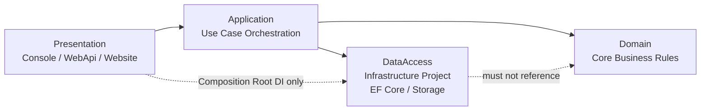

# 雲端檔案管理系統規格書（MVP + Phase 2 規劃）

## 1. 文件定位
- 本文件由 `docs/requirement.md` 轉換而來，作為實作與驗收用的規格基準（Specification）。
- 適用範圍：本文件主體為 MVP（不含 Bonus）；另包含 Phase 2（MMP）可用性強化規劃。
- 術語對照：本文使用 `DataAccess` 表示資料存取層；在目前程式碼專案中對應 `CloudFileManager.Infrastructure`（即 DataAccess 的實作專案）。
- 契約對照：跨層資料契約統一放置於 `CloudFileManager.Contracts` 扁平命名空間，不再區分 `Requests` / `Responses` 子命名空間。

## 2. 目標與成功條件
### 2.1 產品目標
- 建立可於 Console、WebApi 與 Website 驗證的雲端檔案管理系統核心模型與邏輯。
- 以物件導向設計呈現檔案/目錄領域關係，支援遞迴結構操作。

### 2.2 成功條件（Done Criteria）
- 可建立並輸出題目指定之目錄樹與檔案細節（支援 Console、WebApi、Website）。
- 可計算任一目錄總容量（含所有子目錄與檔案）。
- 可依副檔名搜尋並回傳完整路徑清單。
- 可輸出語意正確的 XML 結構。
- 計算大小與搜尋流程皆可輸出 Traverse Log。

## 3. 交付物規格
- SP-DEL-001：UML Class Diagram（需含繼承、關聯、聚合或組合關係）。
- SP-DEL-002：ER Model（Schema 設計）。
- SP-DEL-003：程式碼實作（C#）。
- SP-DEL-004：可驗證功能執行結果（Console、WebApi、Website 三種介面皆可驗證）。
- SP-DEL-005：設計與實作概念說明（README/文件）。
- SP-DEL-006：GitHub Repository 連結（含可檢視之完整程式碼與文件）。

### 3.1 交付驗收細則（對齊 `docs/mvp_ac.md` C8.1~C8.6）
- SP-DEL-007：UML 需可明確辨識 `Inheritance`、`Association`，以及 `Aggregation` 或 `Composition`（至少其一）。
- SP-DEL-008：ER Model 需可檢核主鍵/外鍵、目錄遞迴關係、檔案共通屬性與型別專屬屬性映射。
- SP-DEL-009：C# 專案需可建置且可啟動執行 MVP 核心流程（至少覆蓋 F1~F5）。
- SP-DEL-010：驗收證據需逐項對應 F1~F5，至少包含執行命令、輸出片段與資料集版本資訊。
- SP-DEL-011：README 至少需包含環境需求、建置步驟、執行方式、示範輸出、設計摘要與文件索引。
- SP-DEL-012：Repository 連結需可由評分者存取，且可找到需求、規格、模型、架構、程式碼與驗收紀錄。

## 4. 領域模型規格
### 4.1 物件類型
- SP-DOM-001：系統需支援 `Word`、`Image`、`Text` 三類檔案。

### 4.2 共通屬性
- SP-DOM-002：所有檔案皆需包含 `Name`、`Size`（顯示單位為 KB）、`CreatedTime`。

### 4.3 類型專屬屬性
- SP-DOM-003：Word 檔需具備 `PageCount`。
- SP-DOM-004：Image 檔需具備 `Width`、`Height`。
- SP-DOM-005：Text 檔需具備 `Encoding`（如 UTF-8）。

### 4.4 目錄結構約束
- SP-DOM-006：目錄（Directory）可包含多個檔案。
- SP-DOM-007：目錄可包含子目錄，層級不限（遞迴樹狀結構）。
- SP-DOM-008：目錄本身需具備名稱。
- SP-DOM-009：檔案必須隸屬於某個目錄，不可獨立存在。

### 4.5 ER Schema 實作基線（定案）
- SP-DOM-010：資料表基線固定為 `directories`、`files`、`file_metadata` 三表。
- SP-DOM-011：`file_metadata` 採單表集中式設計，並以 `file_type` 區分 `Word`、`Image`、`Text` 專屬欄位。
- SP-DOM-012：`files` 與 `file_metadata` 需維持 1:1 關係（`file_metadata.file_id` 為 PK + FK）。
- SP-DOM-013：`file_metadata(file_id, file_type)` 必須參照 `files(id, file_type)`，確保檔案型別一致性。
- SP-DOM-014：需具備核心唯一性約束：`UNIQUE(directories.parent_id, directories.name)`、`UNIQUE(files.directory_id, files.name)`。
- SP-DOM-015：需具備型別欄位合法性約束（`CHECK` 或等價驗證機制），確保不同 `file_type` 僅能填入合法 metadata 欄位組合。

## 5. 正式資料來源規格
- SP-DATA-001：系統啟動後需可載入正式資料來源的根節點 `Root`；在無資料時應可呈現空樹。
- SP-DATA-002：正式執行流程之資料來源需為「儲存路徑中的實體檔案 + 資料庫中的檔案/目錄中繼資料」。
- SP-DATA-003：正式執行僅允許實體儲存與資料庫中繼資料，啟動時不得使用任何預先植入資料來源。
- SP-DATA-004：MVP 驗收允許使用「題目示例資料集」進行測試，但需明確標記為驗收資料，不得視為正式執行資料來源。
- SP-DATA-005：驗收文件需標示本次使用資料集類型（題目示例/自訂資料集）與資料版本，以確保檢查結果可重現。

## 6. 功能規格（Functional Specification）
### 6.1 F1 目錄結構呈現
- SP-FUNC-001：系統需可從實際資料來源載入目錄樹（無資料時可呈現空樹）。
- SP-FUNC-002：系統需於 Console、WebApi、Website 輸出完整目錄樹與檔案細節（頁數/解析度/編碼/大小KB/建立時間）。
- SP-FUNC-019：目錄樹輸出需能明確辨識父子層級（例如縮排、樹枝前綴或等價表示法）。
- SP-FUNC-024：驗收資料集需可建立至少 3 層目錄深度（含 Root 與巢狀子目錄）以驗證遞迴結構。
- SP-FUNC-025：同層節點建立順序需可被重現，並可由 DFS 與 Traverse Log 驗證一致性。

### 6.2 F2 遞迴計算總容量
- SP-FUNC-003：系統需提供計算任一目錄總容量的方法，計算範圍含所有子目錄與檔案。
- SP-FUNC-004：容量計算內部單位統一為 Bytes。
- SP-FUNC-005：容量顯示可格式化為 KB/MB，換算規則固定為 `1KB = 1024B`、`1MB = 1024KB`。
- SP-FUNC-020：空目錄總容量計算結果需為 `0B`。
- SP-FUNC-026：若採題目示例資料集驗收，需於驗收文件提供 Root 與至少 1 個中介層目錄之人工換算與程式輸出比對證據。

### 6.3 F3 副檔名搜尋
- SP-FUNC-006：系統需支援輸入副檔名（例：`.docx`）進行搜尋。
- SP-FUNC-007：搜尋結果需回傳完整路徑。
- SP-FUNC-008：遍歷規則採 DFS（Pre-order），同層節點依建立順序走訪。
- SP-FUNC-009：搜尋結果順序依遍歷發現順序回傳，不進行額外排序。
- SP-FUNC-021：路徑輸出格式需一致（是否包含 `Root`、路徑分隔符規則、大小寫策略需文件化且固定）。
- SP-FUNC-027：搜尋無命中副檔名時需回傳空集合，不得拋出未處理錯誤。

### 6.4 F4 XML 結構輸出
- SP-FUNC-010：系統需提供目錄樹轉換 XML 的輸出方法。
- SP-FUNC-011：XML 驗收以「結構層級與內容語意一致」為準，不強制節點名稱逐字對齊題目範例。
- SP-FUNC-022：XML 檔案節點需包含檔案共通屬性 `Name`、`Size`、`CreatedTime`。
- SP-FUNC-023：XML 檔案節點需包含各型別專屬屬性（Word=`PageCount`、Image=`Width/Height`、Text=`Encoding`）。
- SP-FUNC-028：XML 輸出需可由標準 XML Parser 成功解析（格式合法、標籤閉合正確）。

### 6.5 F5 功能進度追蹤（Process Logging）
- SP-FUNC-012：執行「計算大小」與「搜尋」時，需輸出 Traverse Log。
- SP-FUNC-029：WebApi 與 Website 需可檢視對應走訪資訊（例如 API 回傳 Trace/Log 或可查詢執行紀錄）。
- SP-FUNC-013：Traverse Log 走訪規則需與搜尋一致（DFS Pre-order + 同層建立順序）。

### 6.6 F6 Website 功能對齊 Console
- SP-FUNC-014：`Website` 需提供可操作 UI，涵蓋 `Console` 既有管理能力：建立/刪除/搬移/改名（檔案與資料夾）、上傳、搜尋、容量查詢、XML、Feature Flags。
- SP-FUNC-015：`Website` 觸發操作時，需統一經由 `WebApi`，且結果語意（成功/失敗與錯誤訊息）需與 `Console` 一致。
- SP-FUNC-016：若現行 `WebApi` 契約無法支持瀏覽器情境（例如檔案下載回傳型態），需調整 `WebApi` 契約以支援 `Website`，且不得破壞既有核心業務規則。
- SP-FUNC-017：`Website` 需提供最小可用回饋（成功/失敗訊息、必要輸入驗證），避免僅顯示唯讀結果。
- SP-FUNC-018：`Website` 功能覆蓋範圍需在文件中明確列示，並可由驗收案例逐項重現。

## 7. 非功能規格（Non-Functional Specification）
- SP-NFR-001：系統需同時提供 Console、WebApi、Website 三種操作/驗證介面。
- SP-NFR-002：程式碼需具可讀性、可維護性，並維持清楚分層。
- SP-NFR-003：資料儲存策略可採 SQLite，並保留 SQL Server 部署彈性（屬實作策略加值，非題目強制）。
- SP-NFR-004：表現層需可分為 `Console` 與 `WebApi + Website` 兩條通道，且共用同一套 `Domain` 業務流程。
- SP-NFR-005：`Website` 不得直接存取 `DataAccess`；所有操作需經由 `WebApi` 介面進入。
- SP-NFR-006：`DataAccess` 需以 EF Core 實作，預設 Provider 為 SQLite；切換至 SQL Server 時不得改動 `Domain` 介面契約。
- SP-NFR-007：Provider 相容性需透過整合測試驗證核心行為（Upload/List/Search/Move/Delete）。
- SP-NFR-008：資料庫 Provider 切換僅允許變更 `DataAccess`/DI 註冊，不得改動 `Domain` 對外契約。
- SP-NFR-009：資料模型採 EF Core Code First，資料庫結構變更需以 Migration 版本化管理。
- SP-NFR-010：系統需提供自動檢查機制，至少涵蓋組態合法性與 Migration 狀態，並可於 CI 固定執行。
- SP-NFR-011：解決方案分層專案基線採 `Presentation`、`Domain`、`DataAccess` 三專案，不強制拆分 `IDomain`、`IDataAccess` 類型介面專案。
- SP-NFR-012：`Domain` 應維持可獨立發佈邊界（可打包為 lib/NuGet），不得直接依賴 `DataAccess` 或其他外層技術實作。
- SP-NFR-013：`Presentation` 允許參考 `DataAccess`，但僅限 Composition Root 進行 DI 組裝（例如呼叫 `AddInfrastructure(...)`），不得在業務流程中直接依賴具體儲存實作。
- SP-NFR-014：僅在跨解決方案重用、契約獨立版本化或 Plugin 化需求成立時，才允許額外抽出 `Domain.Abstractions` 類型契約專案。
- SP-NFR-015：`Presentation` 對外 I/O 應使用通道專屬模型，呼叫 `Application` 前需映射為跨層 `Contracts` 模型。
- SP-NFR-016：`Contracts` 模型採 class-based 契約型別，並維持扁平命名空間以降低跨層依賴複雜度。
- SP-NFR-017：專案結構需維持語意一致：`Infrastructure` 以 `DataAccess`、`FileStorage`、`Bootstrap` 與 `DependencyRegistrar` 分責；`WebApi` 專屬模型集中於 `WebApi/Model`。
- SP-NFR-018：`Website` 與 `Console` 需維持功能語意一致性；若因通道特性導致操作形式不同，需文件化差異與對應流程。

### 7.1 分層責任與依賴邊界（Mermaid）



- 說明 1：`Domain` 聚焦核心業務規則（What is valid），不依賴外層技術。
- 說明 2：`Application` 負責用例流程編排（How to execute），可協調 `Domain` 與 `DataAccess`（實作於 `Infrastructure` 專案）。
- 說明 3：`Presentation` 僅負責輸入/輸出與通道適配，不承載核心規則。

## 8. 設定檔規格（Configuration Specification）
- SP-CONF-000：設定檔需包含 `ConfigVersion`，作為相容性與升級判斷依據。
- SP-CONF-001：實際檔案儲存根路徑需由設定檔提供（例如 `StorageRootPath`），不得硬編碼於程式。
- SP-CONF-002：`StorageRootPath` 允許絕對路徑或相對路徑；相對路徑以應用程式啟動目錄為基準解析。
- SP-CONF-003：啟動時若 `StorageRootPath` 不存在，系統需自動建立目錄並記錄初始化訊息。
- SP-CONF-004：遍歷與搜尋相關規則可由設定檔宣告（預設為 `DFS Pre-order` 與 `CreationOrder`），但 Mvp 預設行為不得改變既定驗收結果。
- SP-CONF-005：Console Logging 等級需可設定（建議：`Info`、`Debug`），以控制 Traverse Log 詳細度。
- SP-CONF-006：XML 輸出目標需可設定（輸出至 Console 或檔案路徑），預設輸出至 Console。
- SP-CONF-007：副檔名白名單需依檔案類型分組設定，不可僅以單一清單表示。
- SP-CONF-008：需提供 `AllowedExtensions.Word`、`AllowedExtensions.Image`、`AllowedExtensions.Text` 三組設定。
- SP-CONF-009：副檔名比對規則為不分大小寫，且統一正規化為小寫、`.` 開頭格式。
- SP-CONF-010：建立檔案時，副檔名需符合對應類型白名單；不符合時需回報可判讀錯誤。
- SP-CONF-011：搜尋副檔名時，輸入值需先正規化後再比對（例如 `DOCX` -> `.docx`）。
- SP-CONF-012：若 `AllowedExtensions` 未提供完整設定，系統需套用預設值：`Word=[.docx]`、`Image=[.png,.jpg,.jpeg]`、`Text=[.txt]`。
- SP-CONF-013：設定值驗證失敗時，需回傳標準化錯誤格式（包含 `ErrorCode`、`Field`、`Message`）。
- SP-CONF-014：系統需支援功能旗標（Feature Flags）設定，以控制非核心功能啟用狀態。
- SP-CONF-015：設定檔欄位採向後相容原則；允許新增欄位，不得任意變更既有欄位語意。
- SP-CONF-016：需支援資料庫 Provider 設定（預設 `Sqlite`），並可透過設定切換為 `SqlServer`。
- SP-CONF-017：需支援資料庫連線字串設定；SQLite 與 SQL Server 需各自提供對應鍵值。
- SP-CONF-018：`Database.Provider` 合法值僅允許 `Sqlite`、`SqlServer`（不分大小寫）；未設定時預設為 `Sqlite`。
- SP-CONF-019：啟動時需驗證 `Database.Provider` 對應之連線字串存在且非空（`ConnectionStrings.Sqlite` 或 `ConnectionStrings.SqlServer`）。
- SP-CONF-020：當 `Database.Provider` 非法或缺少對應連線字串時，系統需阻止啟動並回傳標準化錯誤（`ErrorCode`、`Field`、`Message`）。
- SP-CONF-021：需支援 `Database.MigrateOnStartup` 設定（布林值），未設定時預設為 `false`。
- SP-CONF-022：系統級設定（儲存、資料庫、功能旗標、管理策略）需集中於 `WebApi` 設定，不得分散至 `Website`。
- SP-CONF-023：`Website` 設定僅允許站台層參數（如 `WebApiBaseUrl`、站台自身 `Logging`/`AllowedHosts`），不得承載後端業務設定。
- SP-CONF-024：`Website` 不得持有資料庫連線字串、`StorageRootPath`、`Management.*`、`FeatureFlags.*`、`AllowedExtensions.*`、`Output.*`。
- SP-CONF-025：`Website` 與 `WebApi` 可有同名設定鍵（例如 `Logging`），但語意需各自獨立且不可互為真實來源。
- SP-CONF-026：設定分層規範需文件化並可被檢查（參照 `docs/config-boundary-checklist.md`）。

## 9. 擴充性與維護性規格
- SP-EXT-001：新增檔案類型時，需透過擴充契約（介面或抽象基底）實作，不得修改既有核心流程分支。
- SP-EXT-002：檔案類型處理邏輯需採註冊式設計（Registry/Factory），以降低條件判斷耦合。
- SP-EXT-003：Presentation/Domain/DataAccess 職責需明確分離，禁止跨層直接依賴具體實作細節。
- SP-EXT-004：設定缺值時需採預設值策略；僅在關鍵必填欄位缺失時阻止啟動。
- SP-EXT-005：設定與規則變更需優先透過設定檔完成，避免修改業務核心程式碼。
- SP-EXT-006：所有新增設定項需同步補齊對應測試（至少包含合法值與非法值案例）。

### 設定檔範例（`appsettings.json`）
```json
{
  "ConfigVersion": "1.0",
  "Storage": {
    "StorageRootPath": "./storage"
  },
  "Database": {
    "Provider": "Sqlite",
    "MigrateOnStartup": false,
    "ConnectionStrings": {
      "Sqlite": "Data Source=./data/cloud-file-manager.db",
      "SqlServer": "Server=localhost;Database=CloudFileManager;User Id=sa;Password=Your_password123;TrustServerCertificate=true"
    }
  },
  "Traversal": {
    "Mode": "DFS_PRE_ORDER",
    "SiblingOrder": "CREATION_ORDER"
  },
  "Logging": {
    "Level": "Info",
    "EnableTraverseLog": true
  },
  "Output": {
    "XmlTarget": "Console",
    "XmlOutputPath": "./output/tree.xml"
  },
  "AllowedExtensions": {
    "Word": [".docx"],
    "Image": [".png", ".jpg", ".jpeg"],
    "Text": [".txt"]
  },
  "Management": {
    "FileConflictPolicy": "Reject",
    "DirectoryDeletePolicy": "ForbidNonEmpty",
    "MaxUploadSizeBytes": 10485760
  }
}
```

## 10. 管理操作規格（Phase 2 / MMP）
> 本章為可用性強化範圍，不納入本次 MVP 基線驗收（不影響 AC-001~AC-005、AC-024~AC-029）。

### 10.1 檔案管理操作
- SP-MGMT-001：系統需支援檔案上傳（Upload）至指定目錄。
- SP-MGMT-002：系統需支援檔案下載（Download）至使用者指定本機路徑。
- SP-MGMT-003：系統需支援檔案搬移（Move）至其他目錄，且不得搬移至非法路徑。
- SP-MGMT-004：系統需支援檔案重新命名（Rename），並驗證同層名稱衝突。
- SP-MGMT-005：系統需支援檔案刪除（Delete），並提供明確錯誤回報。
- SP-MGMT-014：檔案上傳成功時，需同時完成「實體檔案寫入 `StorageRootPath`」與「中繼資料寫入資料庫」兩階段結果一致性。
- SP-MGMT-015：檔案搬移/重新命名/刪除時，需同步更新實體檔案與資料庫中繼資料，避免出現孤兒紀錄或孤兒檔案。

### 10.2 資料夾管理操作
- SP-MGMT-006：系統需支援建立資料夾（Create Directory），父目錄必須存在。
- SP-MGMT-007：系統需支援刪除資料夾（Delete Directory）。
- SP-MGMT-008：刪除資料夾策略需可設定：`ForbidNonEmpty`（預設）或 `RecursiveDelete`。
- SP-MGMT-009：系統需支援資料夾搬移（Move Directory），且不得搬移至自身或其子孫節點。
- SP-MGMT-010：系統需支援資料夾重新命名（Rename Directory），並驗證同層名稱衝突。

### 10.3 管理操作設定建議
- SP-MGMT-011：需支援名稱衝突策略設定 `FileConflictPolicy`（`Reject`/`Overwrite`/`Rename`）。
- SP-MGMT-012：需支援上傳大小限制設定 `MaxUploadSizeBytes`。
- SP-MGMT-013：需支援操作稽核紀錄（至少包含操作時間、目標路徑、結果狀態）。

## 11. 範圍說明（Scope Statement）
- 本規格目前不設 Out of Scope 清單。
- 功能以 `MVP` 與 `Phase 2 / MMP` 分級管理：
  - `MVP`：作為本次最低可交付與核心驗收基線。
  - `Phase 2 / MMP`：屬可用性強化，納入正式功能路線圖與後續驗收。

## 12. 驗收對應矩陣
- AC-001：`SP-FUNC-001` + `SP-FUNC-002` + `SP-FUNC-019` 通過，代表可正確建立與呈現目錄樹，且層級可判讀。
- AC-002：`SP-FUNC-003`~`SP-FUNC-005` + `SP-FUNC-020` 通過，代表總容量計算正確、單位規則一致且空目錄行為正確。
- AC-003：`SP-FUNC-006`~`SP-FUNC-009` + `SP-FUNC-021` 通過，代表搜尋功能正確、輸出順序可預期且路徑格式一致。
- AC-004：`SP-FUNC-010` + `SP-FUNC-011` + `SP-FUNC-022` + `SP-FUNC-023` 通過，代表 XML 輸出符合語意與屬性完整性要求。
- AC-005：`SP-FUNC-012` + `SP-FUNC-013` + `SP-FUNC-029` 通過，代表三種介面皆可驗證演算法遍歷過程。

- AC-024：`SP-FUNC-024` + `SP-FUNC-025` 通過，代表初始化資料集深度與建立順序可支撐遞迴/遍歷驗證（對齊 `C1`）。
- AC-025：`SP-FUNC-026` 通過，代表容量驗收具可重現人工換算證據（對齊 `C3`）。
- AC-026：`SP-FUNC-027` 通過，代表無命中搜尋行為符合預期且具穩定性（對齊 `C4`）。
- AC-027：`SP-FUNC-028` 通過，代表 XML 輸出具結構合法性（對齊 `C5`）。

- AC-006：`SP-CONF-001`~`SP-CONF-003` 通過，代表儲存路徑配置可於不同環境穩定運作。
- AC-007：`SP-CONF-005` + `SP-CONF-006` 通過，代表執行輸出行為可依設定切換。
- AC-008：`SP-CONF-007`~`SP-CONF-012` 通過，代表副檔名規則可依類型控管且輸入行為一致。
- AC-009：`SP-CONF-000` + `SP-CONF-013` + `SP-CONF-015` 通過，代表設定版本與相容性策略可運作。
- AC-010：`SP-CONF-014` + `SP-EXT-001` + `SP-EXT-002` 通過，代表功能擴充可透過配置與註冊機制落地。
- AC-011：`SP-EXT-003`~`SP-EXT-006` 通過，代表分層與維護性要求有落實。
- AC-012：`SP-NFR-004` + `SP-NFR-005` 通過，代表雙表現層分工與依賴邊界符合架構規範。
- AC-013：`SP-DATA-002` + `SP-MGMT-014` + `SP-MGMT-015` 通過，代表實體儲存與資料庫中繼資料已與實際操作一致。
- AC-014：`SP-NFR-006` + `SP-NFR-007` + `SP-CONF-016` + `SP-CONF-017` 通過，代表 SQLite 預設執行與 SQL Server 相容切換策略成立。
- AC-015：`SP-CONF-018` + `SP-CONF-019` + `SP-CONF-020` 通過，代表資料庫 Provider 設定合法性與啟動失敗機制完整。
- AC-016：`SP-NFR-008` 通過，代表資料庫 Provider 切換不破壞 `Presentation/Domain/DataAccess` 分層與對外契約邊界。
- AC-017：`SP-NFR-009` 通過，代表資料模型以 Code First 建立且 Schema 變更可透過 Migration 版本化管理。
- AC-018：`SP-CONF-021` + `SP-NFR-010` 通過，代表自動檢查與 Migration 執行策略可依環境穩定運作。
- AC-019：`SP-NFR-011` + `SP-NFR-013` 通過，代表三專案分層與 DI 組裝邊界符合規範。
- AC-020：`SP-NFR-012` + `SP-NFR-014` 通過，代表 Domain 可獨立打包且契約拆分策略具可控觸發條件。
- AC-021：`SP-DOM-010`~`SP-DOM-015` 通過，代表 ER Schema 定案與資料一致性約束已正確落地。
- AC-022：`SP-CONF-022`~`SP-CONF-026` 通過，代表 `WebApi/Website` 設定分層責任清楚且無語意衝突。
- AC-023：`SP-FUNC-014`~`SP-FUNC-018` + `SP-NFR-018` 通過，代表 `Website` 已達到與 `Console` 一致的可操作能力與可驗證行為。

- AC-028：`SP-DEL-007`~`SP-DEL-012` 通過，代表文件與交付物細節完整（對齊 `C8.1~C8.6`）。

- AC-029：`AC-001`~`AC-005` + `AC-024`~`AC-028` 通過，代表 `docs/spec.md` 已完整覆蓋 `docs/mvp_ac.md` 之 MVP 驗收要求。

## 13. 文件關聯
- `docs/requirement.md`：需求來源。
- `docs/spec.md`：本規格書（實作與驗收依據）。
- `docs/domain-model.md`：UML 與類別設計。
- `docs/er-model.md`：ER 與資料欄位設計（本版已定案）。
- `docs/architecture.md`：分層架構與技術決策。
- `docs/config-boundary-checklist.md`：`WebApi/Website` 設定分層檢查清單。
- `README.md`：執行說明與驗收結果（後續）。

## 14. 部署與交付規格（Docker / Deployment）
> 本章定義容器化部署基線，作為 `docs/task-deploy.md` 的規格對應；預設先以本機與測試環境可重現部署為目標。

### 14.1 範圍與原則
- SP-DEP-001：部署範圍以 `WebApi + Website` 為部署主體（屬交付強化範圍，非 MVP 基線必要條件）。
- SP-DEP-002：容器編排基準採 `docker compose`（v2）。
- SP-DEP-003：映像建置需支援 `dev/prod` 差異化策略。
- SP-DEP-004：資料需具持久化能力（Volume 或 Bind Mount）。
- SP-DEP-005：設定值覆蓋順序以環境變數優先於 appsettings。

### 14.2 映像建置規格
- SP-DEP-006：`WebApi` 需具可重現 Dockerfile（建置/執行分階段）。
- SP-DEP-007：`Website` 需具可重現 Dockerfile（靜態站點或前端服務）。
- SP-DEP-008：需提供 `.dockerignore`，排除不必要檔案以降低建置上下文。
- SP-DEP-009：映像標記需支援版本標籤與 `latest`。
- SP-DEP-010：映像需採最小化與最小權限原則（建議非 root）。

### 14.3 編排與網路規格
- SP-DEP-011：需提供 `docker-compose.yml` 管理服務拓樸。
- SP-DEP-012：服務名稱與網路需可供容器內部 DNS 解析。
- SP-DEP-013：埠對映需可配置且避免衝突。
- SP-DEP-014：需定義服務啟動依賴與就緒策略。
- SP-DEP-015：需支援 profile（如 `dev`、`prod`）切換。

### 14.4 設定與安全規格
- SP-DEP-016：需定義必要環境變數清單與預設值策略。
- SP-DEP-017：需提供部署環境變數文件（鍵名、用途、預設值），且不得包含敏感資訊。
- SP-DEP-018：連線字串與路徑需可透過環境變數注入。
- SP-DEP-019：敏感資訊不得提交至版本控制。
- SP-DEP-020：啟動檢查輸出需可判讀，且敏感資訊需遮罩。

### 14.5 儲存、健康檢查與觀測
- SP-DEP-021：`StorageRootPath` 需可對應容器掛載路徑。
- SP-DEP-022：重啟容器後資料需可保留與讀取。
- SP-DEP-023：XML 或其他輸出檔案目錄需可掛載保存。
- SP-DEP-024：需明確定義首次啟動與重啟初始化行為。
- SP-DEP-025：需文件化資料清理/重置策略。
- SP-DEP-026：`WebApi` 需提供健康檢查端點（例如 `/health`）。
- SP-DEP-027：Compose 需設定 healthcheck 與重試策略。
- SP-DEP-028：容器日誌需具最小可判讀格式（時間、等級）。
- SP-DEP-029：需提供標準除錯操作指引（logs/ps/exec）。
- SP-DEP-030：需定義最小可用驗證流程（網站與 API 連通）。

### 14.6 CI/CD 與文件交付（建議）
- SP-DEP-031：CI 需可完成映像建置與基本驗證。
- SP-DEP-032：主分支需具版本標記與映像標記策略。
- SP-DEP-033：失敗流程需保留必要檢查輸出（log/test result）。
- SP-DEP-034：正式環境發佈建議具人工核准節點。
- SP-DEP-035：需具可執行回滾策略（上一版映像回退）。
- SP-DEP-036：`README.md` 需提供最小部署指令流程。
- SP-DEP-037：需提供 `docs/deploy.md` 作為部署手冊。
- SP-DEP-038：需說明版本相容矩陣（Docker/Compose/.NET）。
- SP-DEP-039：需提供最小維運命令集（build/up/down/logs/reset）。
- SP-DEP-040：需揭露部署限制與已知風險。

## 15. 部署驗收對應矩陣（AC-DEP）
- AC-DEP-001：`SP-DEP-006` + `SP-DEP-007` + `SP-DEP-011` 通過，代表可成功建置並啟動容器化服務。
- AC-DEP-002：`SP-DEP-001` + `SP-DEP-012` + `SP-DEP-014` 通過，代表 Website 經 WebApi 操作之依賴邊界正確。
- AC-DEP-003：`SP-DEP-004` + `SP-DEP-021` + `SP-DEP-022` 通過，代表資料持久化策略可運作。
- AC-DEP-004：`SP-DEP-026` + `SP-DEP-027` + `SP-DEP-030` 通過，代表服務可觀測性與可用性檢查到位。
- AC-DEP-005：`SP-DEP-005` + `SP-DEP-016` + `SP-DEP-018` 通過，代表設定覆蓋策略可預期。
- AC-DEP-006：`SP-DEP-036` + `SP-DEP-037` + `SP-DEP-039` 通過，代表新成員可依文件完成部署。
